# 1. 아키텍처
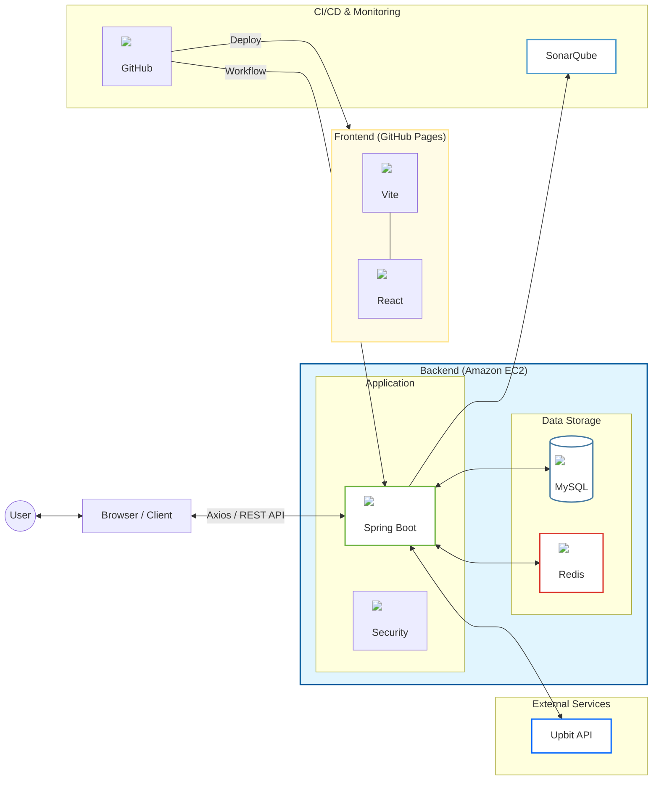

# 2. 시퀀스 다이어그램

## 1) 코인 매수
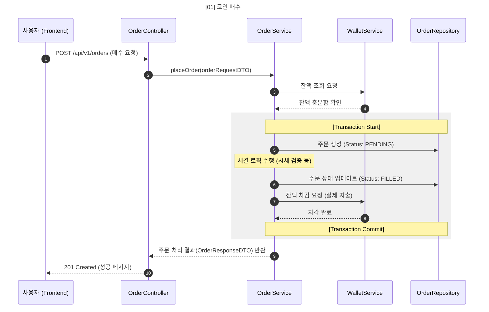

## 2) 시세 조회
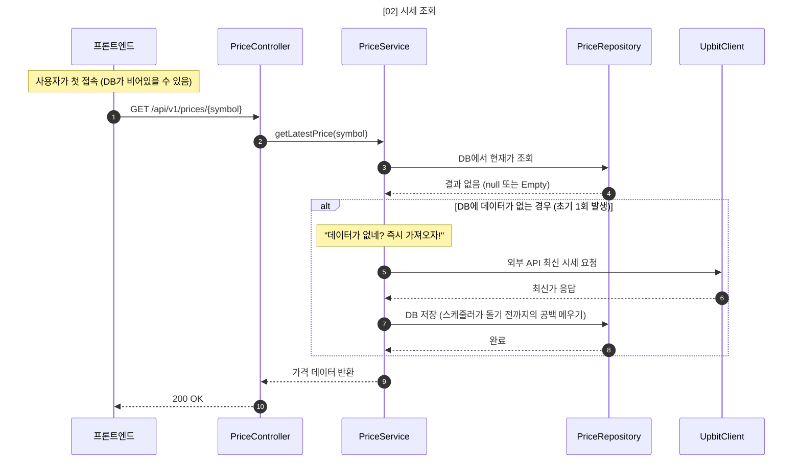
## 3) 코인 목록 조회
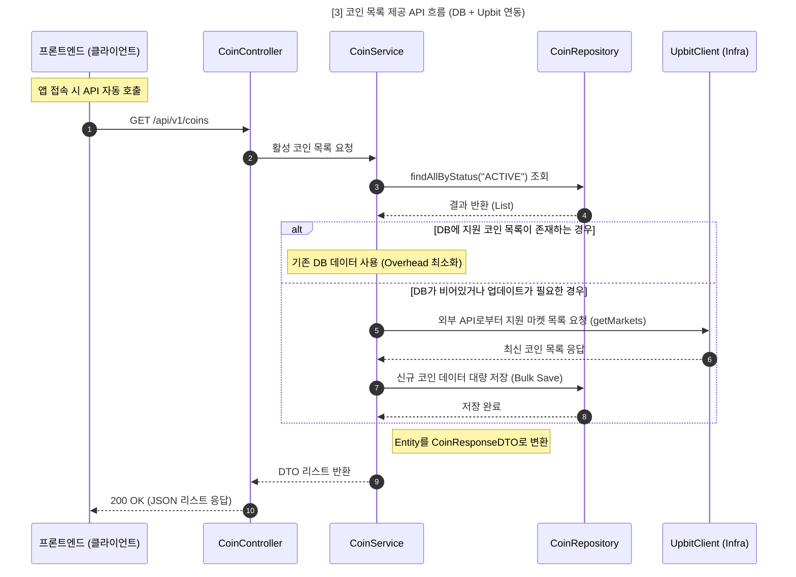
## 4) 체결 내역 조회
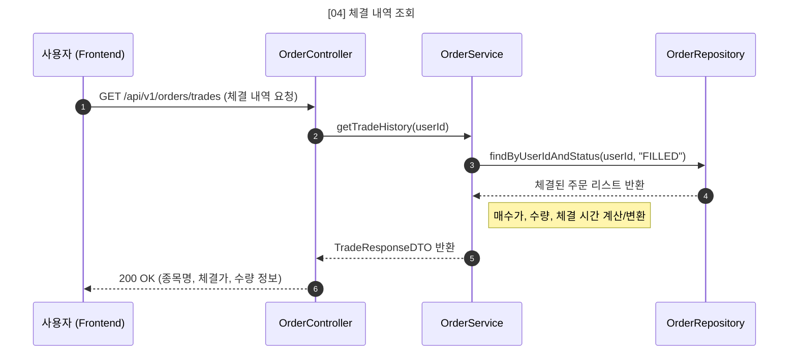
## 5) 미체결 주문 취소
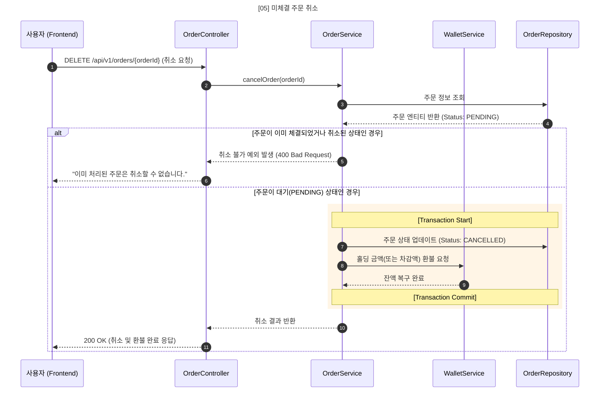
## 6) 지갑 변동 내역 조회
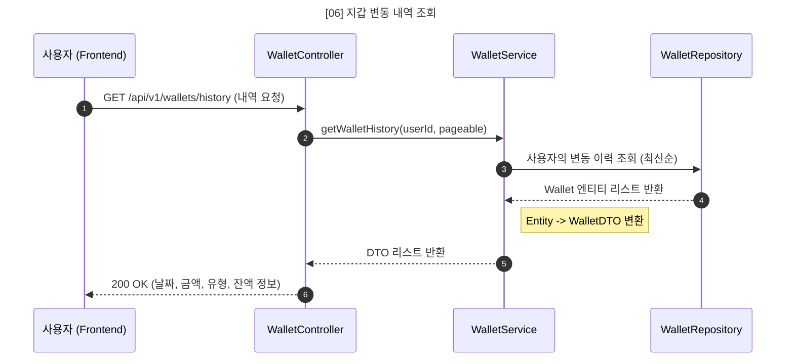
## 7) 자산 현황 조회
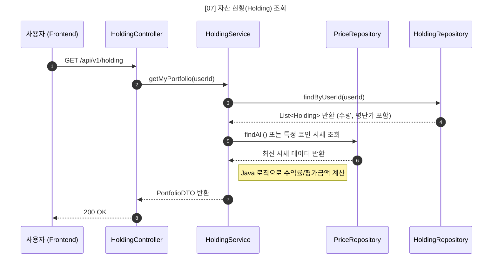

## 8) 실시간 시세 수집
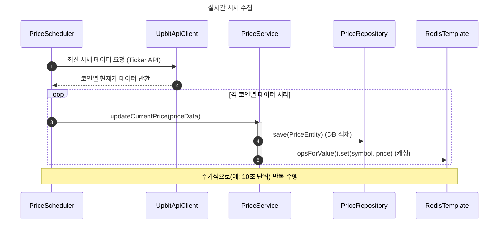

## 9) 주문 체결 처리
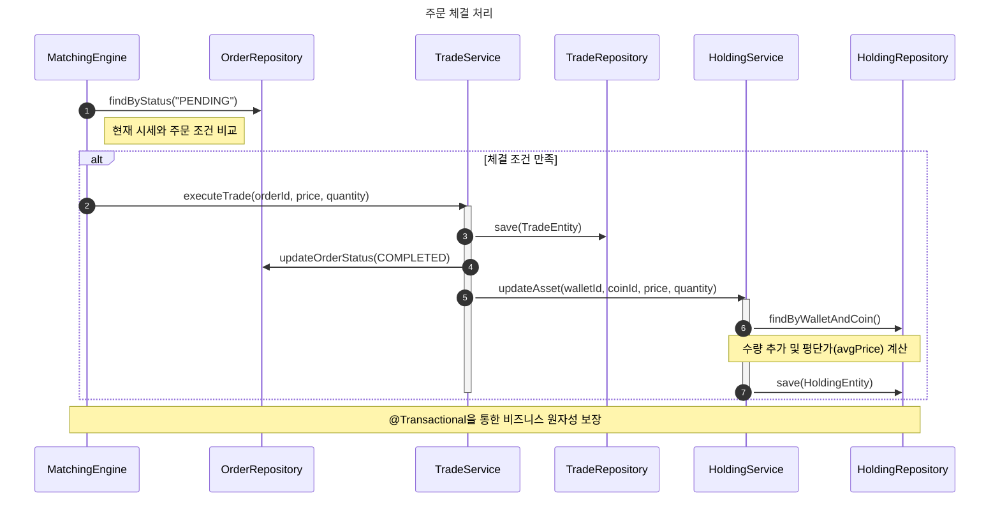

## 10) 초기 자금 지급
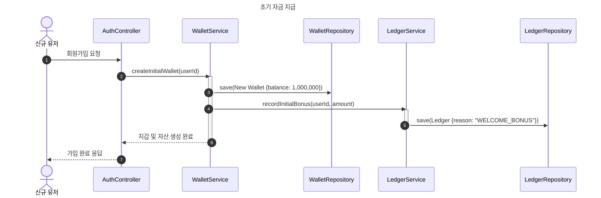

## 11) 미체결 주문 취소
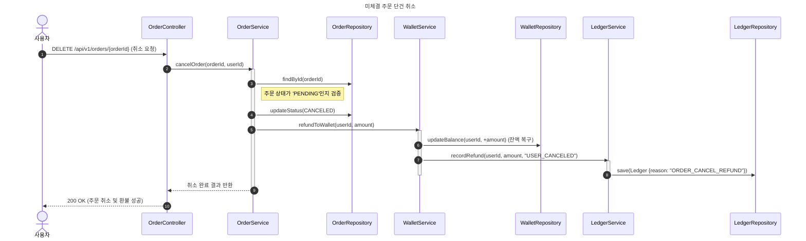

# 3. ERD

